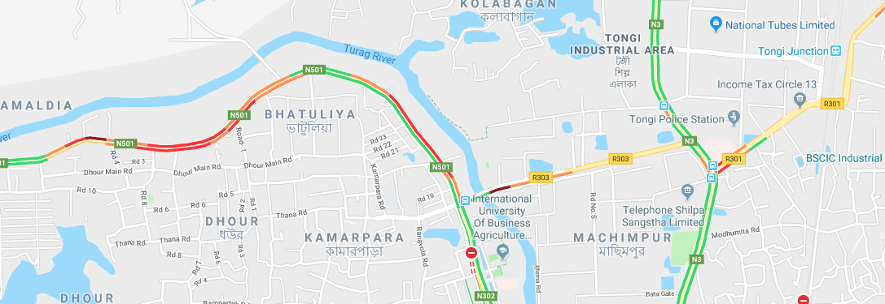

# Solving Usual Problems of Developing Countries Through AI and Other Tech-buzzwords

A curated list of usual problems in developing countries and how to solve them with recent tech buzzwords: `Artificial Intelligence`,`Machine Learning`, `Virtual Reality`, `Augmented reality`,`Internet of Things`,`Data analytics`

# Table of Contents
- [Decreasing Dropping Rates of Primary and High School Education](#decreasing-dropping-rates-of-primary-education)
- [Traffic Congestion / Traffic Jam Solving Through the Use of IOT, Google Maps and AI](#traffic-jam)

### Decreasing Dropping Rates of Primary Education
Dropping rates of primary education is decreasing, but slowly. But with the tech we have today, we won't let another Steve Jobs fade away. We can diminish the dropping rate totally. If we analyze the available data to determine regional problems (a region might have hunger problem but another might have disease problem) and with the help of government, we can make the world a better place, maybe at least for some kids.

Just for a bit of motivation:

In 1993, Bangladesh Govt had an outstanding approach to solve hunger as it was causing more dropouts in primary education. They launched [Food for Education](http://www.ifpri.org/publication/food-education-program-bangladesh) program. The FFE program provides a free monthly ration of rice or wheat to poor families if their children attend primary school. The goals of this program are to increase primary school enrollment, promote attendance, reduce dropout rates, and enhance the quality of education.

Instead of providing food everywhere, we might use `Data Science` and freely available govt data to determine which region needs what to keep the primary school crowd rolling. 

### Traffic Jam
Well, it has been the key problem that stops a developing country to move forward. How can a country progress when the people who makes it progress get stuck on a traffic jam, wasting time for nothing. If we start connecting all the vehicles with each other (`IOT`), gather data and process that data with Advanced Algorithm or `AI`, with a bit help of `Google Maps`, maybe we can solve the traffic problem without constructing more roads.

Implementing IOT might stay as a theory for many years in a developing country as the cars just started to use this technology. Instead, we might use a few previous years of traffic data to build a ML algorithm that might take some considerations as national holidays, inter-political events, national depression days (damn, we lost that cricket match) to indicate a jam free route.

**Fortunately Google has already solved this problem, it seems. Someone has to. Someone will.**
Red maked roads are the routes you simply have to ignore.

